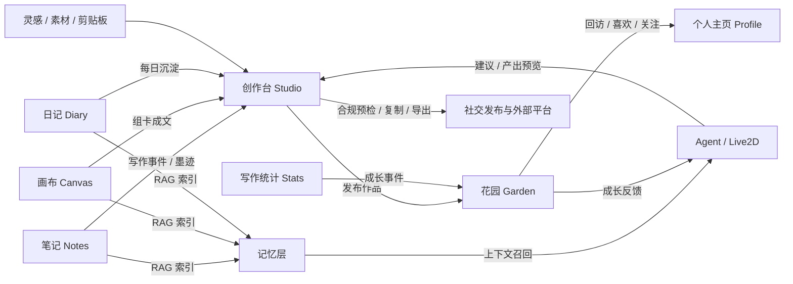
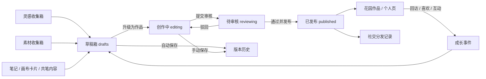
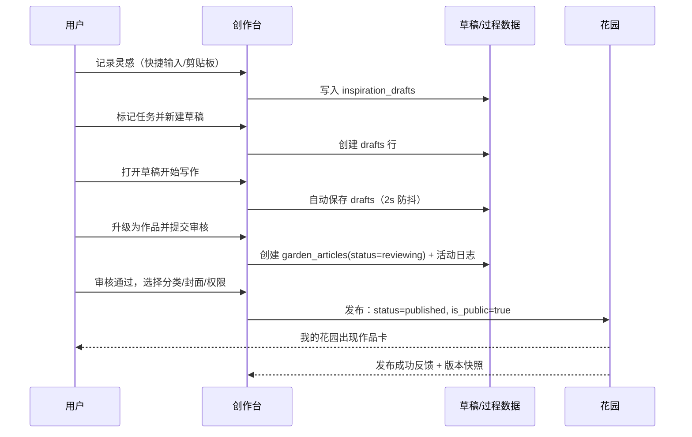
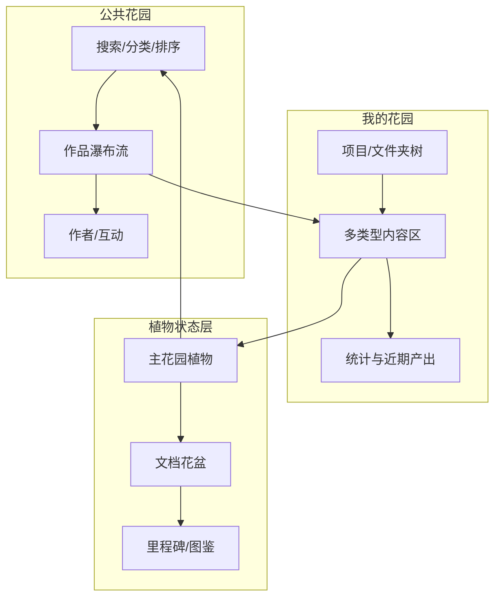
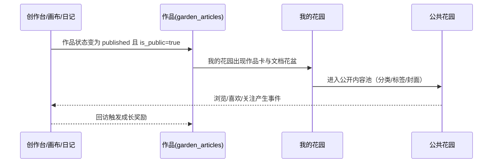
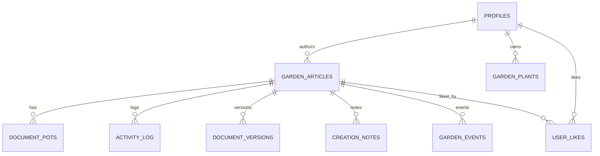

# 花笺·创作台与花园一体化完善设计方案

> 日期：2026-08-26
> 项目：floral-notepaper
> 状态：设计稿（待评审后进入实施）
> 范围：侧边栏「创作台」（Studio）与「花园」（Garden）两个模块的完善优化

## 关联文档

- `Docs/PRD.md`：产品需求与三大方向（墨迹回放 / 共笔模式 / 写作花园）
- `Docs/writing-garden-game-design.md`：写作花园养成小游戏设计
- `Docs/商业化系统设计方案.md`：收费模型、花园-额度联动
- `Docs/plans/2026-07-22-floral-creation-studio-design.md`：创作台块级编辑器与创作过程管理设计
- `Docs/plans/2026-08-08-auth-canvas-garden-profile-design.md`：花园与个人页重构设计
- `Docs/plans/2026-08-09-canvas-product-design.md`、`2026-08-14-canvas-writeup-productive-agent-design.md`、`2026-08-14-knowledge-canvas-design.md`：画布成文与 Agent 产出闭环

## 0. 摘要

花笺的定位是「面向写作过程的、有人情味的桌面写作伴侣」。本次设计把「创作台」和「花园」从静态工具视图、内容列表，升级为一条可闭环、可沉淀、可成长的主线：

1. 创作台补齐「灵感 → 草稿 → 创作 → 审核 → 发布 → 花园/社交」的完整业务节点，让每一个创作过程步骤都有数据、有状态、可回看。
2. 花园升级为「公共发现 + 个人管理 + 写作成长」三层结构，把真实写作行为映射为温和的植物成长反馈，而不是静态文案。
3. 以 `garden_articles` 作为作品单一事实源，创作台的过程数据、画布产出、日记沉淀都汇聚到同一作品模型，消除数据孤岛与双编辑器冲突。
4. 全部新增能力沿用现有技术栈（React + Zustand + Supabase + Tauri/Rust + TipTap），通过增量字段和默认值兼容旧数据，不推倒既有模块。

设计验收目标：创作台任一作品都能走完「灵感 → 成文 → 审核 → 发布 → 在花园被看见/被回访」的完整链路；花园不再出现只靠文章数量硬算的「生长状态」，所有成长反馈都来自可追溯的写作事件。

## 1. 核心业务定位与用户诉求

### 1.1 花笺整体定位

花笺不是传统便签工具，而是以「写作过程」为核心资产的桌面写作伴侣：

- 关注过程，而非产出：墨迹录制、回放、写作画像让创作过程本身可被看见。
- 工具是陪伴，而非命令：Agent 与 Live2D 花灵提供轻量、不打扰的反馈。
- 每一次写作都是一次旅程：文档可以记录成长、被回访、被沉淀为花园。

据此，创作台与花园承担不同但连续的责任：

| 模块 | 一句话定位 | 承担的产品方向 |
| --- | --- | --- |
| 创作台 | 从灵感到成文的「创作过程工作台」 | 共笔模式（B）、墨迹回放（A）的产出入口 |
| 花园 | 写作成果与长期习惯的「可视成长空间」 | 写作花园（C）、社交发现、个人主页内容源 |

### 1.2 创作台核心使用场景

- 灵感随手记录：不打断写作，先记后整理。
- 素材收集与关联：把网页、微信文章、本地笔记、画布卡片收拢到一篇作品。
- 分阶段创作：草稿 → 创作中 → 待审核 → 已发布，状态清晰可切换。
- 过程复盘：查看创作轨迹、版本历史、批注，理解自己怎么写成这篇作品。
- 多平台分发：合规预检后复制到小红书、导出 Notion、发布到花园。
- 与 Agent 协作：画布组卡成文、共笔内容、AI 润色产出都能进入创作台继续加工。

### 1.3 花园核心使用场景

- 发现他人作品：按分类、标签、作者浏览公开内容，产生互动。
- 管理自己的成果：项目/文件夹组织文章、画布、草稿、灵感集合。
- 观察写作成长：植物状态、文档花盆、连续天数与里程碑把长期写作变成可感知的回访点。
- 发布回流：创作台、画布、日记的产出统一在花园沉淀，再进入个人主页与社交传播。

### 1.4 用户诉求 → 功能映射

| 用户诉求 | 对应场景 | 创作台功能 | 花园功能 |
| --- | --- | --- | --- |
| 灵感不丢 | 随时记录想法 | 灵感收集箱、剪贴板/链接导入 | 灵感集合卡片 |
| 创作有进度 | 长文与图文创作 | 草稿箱、真实看板、状态机 | 我的花园项目树与状态筛选 |
| 过程可复盘 | 想知道自己怎么写出来的 | 创作轨迹、版本历史、批注 | 文档花盆成长记录 |
| 成果被看见 | 发布与传播 | 合规预检、发布到花园/社交 | 公共花园发现与互动 |
| 长期有陪伴 | 持续写作不枯燥 | Agent/花灵轻反馈 | 植物成长、回访奖励、成就 |

## 2. 现状盘点与差距分析

### 2.1 创作台现状

| 能力 | 实现位置 | 现状 |
| --- | --- | --- |
| 块级编辑器 | `src/features/studio/components/EditorCanvas.tsx` | TipTap 编辑器，SlashMenu、工具栏、自动保存已接入 |
| 自动保存 | `src/features/studio/hooks/useAutoSave.ts` | 2s 防抖 + 卸载前保存；直接读写 `garden_articles`，未用 `drafts` 表 |
| 创作列表 | `src/features/studio/components/EditorSidebar.tsx` | 文章/草稿/灵感三个 tab；草稿 tab 是空态，灵感 tab 只读内存 |
| 看板 | `src/features/studio/components/KanbanBoard.tsx` | 四列静态展示；`setArticles` 中所有列都取 `articles.slice(0, 5)`，不是按状态真实分组 |
| 灵感收集 | `src/features/studio/components/InspirationCollector.tsx` | 保存到 `inspiration_drafts`；列表不加载历史，未支持转任务 |
| 素材收集 | `src/features/studio/components/MaterialCollector.tsx` | 解析链接并保存到 `collected_materials`；列表不加载历史，未关联文章/画布 |
| 创作轨迹 | `src/features/studio/hooks/useActivityLog.ts`、`ActivityTimeline.tsx` | 只写不读，进入页面不拉取 `activity_log` |
| 版本历史 | `supabase/migrations/011_studio_tables.sql` | `document_versions` 表已建，无写入逻辑与 UI |
| 创作批注 | `src/features/studio/types.ts` | `CreationNote` 类型已定义，`creation_notes` 表已建，无实现 |
| 分享分发 | `src/features/studio/components/SharePanel.tsx` | 小红书/Notion 已实现；`blocks`、`imageUrls` 传空；未打通发布到花园 |
| 合规预检 | `src/features/studio/services/complianceCheck.ts` | 已实现敏感词、封面、长度、标签、图片数检查 |

### 2.2 花园现状

| 能力 | 实现位置 | 现状 |
| --- | --- | --- |
| 空间切换 | `src/features/garden/components/GardenLayout.tsx`、`SpaceSwitcher.tsx` | 公共/个人两栏切换 |
| 公共花园 | `src/features/garden/pages/PublicGardenPage.tsx` | 分类侧栏 + 内容网格；无搜索、排序、作者、互动 |
| 我的花园 | `src/features/garden/pages/PersonalGardenPage.tsx` | 文件夹列表 + 统计 + 静态植物状态卡片 |
| 文章详情/编辑 | `ArticleDetailPage.tsx`、`ArticleEditorPage.tsx` | Markdown 文本编辑，与创作台 TipTap 形成双编辑器 |
| 状态管理 | `src/features/garden/stores/useGardenStore.ts` | 按 userId 加载分类/文章/文件夹 |
| 成长状态 | `PersonalGardenPage.tsx` | 仅按文章数量返回「萌芽/生长/开花」文案，无真实数据 |
| 数据库 | `supabase/migrations/learning_social_platform.sql` | `garden_articles`、`categories`、`garden_folders` 已建 |

### 2.3 关键差距清单

| 差距 | 影响 | 优先级 |
| --- | --- | --- |
| `garden_articles` 缺 `status`，前端 `useAutoSave` 写 `status`/`user_id` 会失败 | 创作台保存/发布链路不可用 | P0 |
| 看板是伪分组，未按状态过滤、不可拖拽 | 创作流程无法管理 | P0 |
| 草稿箱空壳，`drafts` 表未接前端 | 未落盘草稿容易丢失，无法区分草稿与作品 | P0 |
| 创作轨迹只写不读 | 复盘能力缺失 | P0 |
| 分享面板未真正发布到花园/社交，`blocks`/`imageUrls` 传空 | 分发链路断裂 | P0 |
| 创作批注、版本历史无 UI | 过程记录不完整 | P1 |
| 花园成长状态无数据支撑 | 花园缺乏长期回访价值 | P0 |
| 花园文章编辑与创作台编辑器重复 | 编辑体验分裂、字段不一致 | P0 |
| 文件夹/项目与作品无关联操作 | 我的花园无法组织内容 | P1 |
| 公共花园缺搜索/排序/互动 | 发现能力弱 | P1 |
| 画布成文、日记沉淀未回流到创作台/花园 | 模块之间出现数据孤岛 | P1 |
| 写作事件未接入花园成长管线 | 成长反馈与真实写作脱节 | P0 |

## 3. 一体化设计总览

### 3.1 模块关系图



### 3.2 数据域划分

- 本地优先：笔记正文、墨迹事件、画布 JSON、写作统计（Rust 侧 `notes.rs`、`ink.rs`、`canvas.rs`、`stats.rs`）。
- 云端作品域：`garden_articles`（作品唯一事实源）、`categories`、`garden_folders`。
- 云端过程域：`drafts`、`inspiration_drafts`、`collected_materials`、`creation_notes`、`activity_log`、`document_versions`。
- 云端成长域：`garden_plants`、`document_pots`、`garden_events`（本次新增）。
- 云端社交域：`profiles`、`follows`、`user_stats`、`user_likes`（本次新增）。

### 3.3 单一事实源规则

1. 作品的「内容 + 元信息」只存在 `garden_articles` 一行；创作台、花园、个人页都从该行读写。
2. 作品生命周期状态由 `garden_articles.status` 表达，任何模块不得另建副本状态。
3. 过程数据（草稿、灵感、素材、批注、轨迹、版本）通过 `article_id` 挂到作品；未成文前挂在 `user_id`，成文后回填 `article_id`。
4. 成长数据由写作事件聚合而来，只做展示与激励，不反写作品内容。
5. 跨模块通知走轻量事件总线（现有 `eventBus` / `signalQueue` 模式），避免 Zustand store 互相引用造成循环依赖。

### 3.4 登录与权限矩阵

| 场景 | 游客 | 已登录 |
| --- | --- | --- |
| 浏览公共花园 | 可浏览、不可互动 | 可浏览、可喜欢/关注 |
| 我的花园 / 创作台 | 只读浏览本地内容 | 完整创作、保存、发布 |
| 草稿与过程数据 | 本地 IndexedDB 临时草稿 | 云端 `drafts` 等表，RLS 仅本人 |
| 发布到花园 | 不可发布（引导登录） | 可发布，权限 `private/unlisted/public/friends` |
| Agent 产出 | 仅本地可用能力 | 可落盘并溯源 |


## 4. 创作台完善方案

### 4.1 目标体验与信息架构

创作台从「编辑器 + 静态看板」升级为四区工作台：

- 左栏：创作列表（文章 / 草稿 / 灵感 / 素材 tab）、搜索、新建入口。
- 中栏：TipTap 块级编辑器，顶部为标题、标签、状态、封面、保存状态与操作按钮。
- 右栏（可折叠）：文章检查器、创作批注、版本历史、创作轨迹。
- 浮动面板：灵感收集、素材收集、分享发布，可从工具栏随时唤起。

核心体验原则：

- 状态可见：作品当前处于哪个流程节点，左栏与看板一眼可知。
- 不打断写作：灵感、素材、批注都可以最小成本录入和转正。
- 可回退：版本历史覆盖手动保存节点，恢复前必须预览确认。
- 发布有出口：审核通过后同时生成花园作品与分发记录，不把内容困在创作台。

### 4.2 全流程业务节点



各节点对应的状态值与存储：

| 节点 | `status` 值 | 主存储 | 关键动作 |
| --- | --- | --- | --- |
| 灵感 | `-` | `inspiration_drafts` | 记录、转草稿任务 |
| 草稿 | `draft` | `drafts`（未成文）/ `garden_articles`（已成文） | 自动保存、升级成文 |
| 创作中 | `editing` | `garden_articles` | 编辑、批注、保存版本 |
| 待审核 | `reviewing` | `garden_articles` | 提交审核、审核通过/驳回 |
| 已发布 | `published` | `garden_articles` | 发布到花园/社交、生成分发记录 |

### 4.3 节点功能详述

#### 4.3.1 灵感收集箱

- 输入来源：快捷输入（Ctrl+Enter）、剪贴板、微信链接、浏览器链接。
- 支持「标记为任务」：`is_task = true` 后进入待创作；批量勾选后可一键生成草稿任务。
- 列表从 `inspiration_drafts` 按用户加载，不再只读内存。
- 与现有 `InspirationCollector.tsx` 保持交互，补充历史加载与转任务按钮。

#### 4.3.2 素材收集箱

- URL 解析复用 `services/materialParser.ts`，保存到 `collected_materials`。
- 新增「关联文章 / 关联画布」：素材可挂到 `article_id` 或画布 documentId，插入编辑器时保留来源链接。
- 列表按用户加载，支持按文章过滤，避免素材沉淀在内存里丢失。

#### 4.3.3 草稿箱与自动保存

- 未成文时写入 `drafts` 表（或游客本地 IndexedDB），成文后才创建 `garden_articles` 行，避免把每次击键都写进作品表。
- 自动保存保持 2s 防抖 + 关闭前强制保存；保存状态在工具栏显示「未保存 / 保存中 / 已保存」。
- 草稿可「升级为作品」：新建 `garden_articles` 行，`status = draft`，`source` 标记来源，并把草稿内容迁移过去。
- 修复现有 `useAutoSave` 的 schema 不匹配：作品行只写 `author_id` 与既有列，`status` 先经迁移补齐。

#### 4.3.4 块级编辑器增强

- 保持 TipTap 与现有 SlashMenu/工具栏。
- 顶部元信息条：标题、摘要、封面、分类、标签、权限；编辑时写入 `garden_articles` 元信息字段。
- 防止空白覆盖：沿用 `loadedArticleIdRef` 机制，加载与保存必须绑定同一 `article_id`。
- 为「创作批注转正」预留块级定位：批注记录 `blockId`（TipTap block node id），转正时插入到目标块之后。

#### 4.3.5 创作批注

- 交互：选中文本 → BubbleMenu「添加批注」→ 私密批注列表。
- 数据：`creation_notes`（`article_id`、`block_id`、`content`、`is_promoted`）。
- 转正：批注一键转为正文段落，转正后 `is_promoted = true` 并写入活动日志。
- 导出时可按勾选附带批注（现有 SharePanel 已预留 `notesText`）。

#### 4.3.6 版本历史

- 写入时机：手动保存、状态变更（提交审核/发布/驳回）、恢复操作。
- 版本号：`document_versions.version_number` 按文章递增；`change_summary` 由内容差异摘要生成（可先做字数/块数变化摘要）。
- 恢复流程：选择版本 → 预览差异 → 确认恢复 → 写回 `garden_articles.content` 并生成新版本，避免误操作覆盖。

#### 4.3.7 真实看板

- 列定义保持「待创作 / 创作中 / 待审核 / 已发布」，但内容按 `status` 真实过滤，不再 `slice(0, 5)`。
- 支持拖拽卡片跨列：乐观更新 UI，随后调用状态变更接口，失败回滚并提示。
- 已发布列展示花园链接与分发状态；待审核列可点击进入审核弹窗。
- 待创作列内容来自灵感任务 + 草稿任务，保证「看板是流程入口」而不只是文章列表。

#### 4.3.8 审核与发布

- 提交审核：作品状态 `editing → reviewing`，写活动日志。
- 审核通过并发布：选择分类、封面、权限（`private/unlisted/public/friends`），更新 `garden_articles.status = published` 与 `is_public`，写入花园发布记录。
- 驳回：填写驳回原因，状态回到 `editing`，原因随活动日志保留，前端展示提醒。
- 发布是花园、个人页、社交分发共用的唯一出口，避免三处各自发布产生状态漂移。

#### 4.3.9 分享分发

- 保留小红书格式转换、合规预检、Notion 导出。
- 修复 `SharePanel` 空参数：从编辑器取真实 `blocks`（TipTap JSON）与 `imageUrls`（封面与正文图片）。
- 新增「发布到花园」作为主按钮；复制到小红书 / 下载 Notion 作为分发选项，分发动作写入 `activity_log`。
- 对外发布遵循「先预览后落盘」铁律：小红书预览、Notion 预览、花园发布预览均需用户确认。

#### 4.3.10 创作轨迹与复盘

- 进入创作台时按用户拉取 `activity_log`（按时间倒序 + 文章过滤），不再只显示本次会话。
- 轨迹动作类型扩展：`submit_review`、`approve`、`reject`、`publish_garden`、`restore_version`、`promote_note`。
- 轨迹可与墨迹回放、写作画像互链：轨迹面板提供「查看本篇回放」入口。

#### 4.3.11 与 Agent / Live2D / 画布 / 笔记的衔接

- 画布组卡成文：复用 `canvas.writeup` 链路，产出落为 `garden_articles` 草稿并进入创作台草稿箱，而不是另建一套文章模型。
- Agent 产出：所有写操作经「预览 → 确认」；落盘后自动写 `activity_log` 与 RAG 索引。
- Live2D：发布成功、灵感提示、审核提醒时输出轻量信号，不改动现有 `signalQueue` 协议。
- 笔记导入：本地 Markdown 可导入为创作台草稿，`source = import`，保留原文件路径。

### 4.4 关键交互流程（端到端）



### 4.5 组件与页面变更清单

| 变更 | 位置 | 内容 |
| --- | --- | --- |
| 状态机 | `src/features/studio/types.ts`、`services/statusMachine.ts`（新增） | `ArticleStatus` 迁移规则、动作与日志类型 |
| 看板 | `KanbanBoard.tsx` | 按状态过滤 + 拖拽 + 待审核操作 |
| 草稿箱 | `EditorSidebar.tsx`、`useDrafts.ts`（新增） | drafts 加载/创建/升级 |
| 批注 | `CreationNotesPanel.tsx`（新增） | 列表、转正、关联块 |
| 版本 | `VersionHistoryPanel.tsx`（新增）、`useVersions.ts`（新增） | 快照、预览、恢复 |
| 轨迹 | `useActivityLog.ts`、`ActivityTimeline.tsx` | 历史回读、动作扩展 |
| 分享 | `SharePanel.tsx`、`useShare.ts` | 真实 blocks/images、发布到花园 |
| 自动保存 | `useAutoSave.ts` | 草稿/作品分流、schema 修复 |
| API | `src/features/studio/api.ts`（新增） | 状态变更、审核、版本、发布接口封装 |


## 5. 花园完善方案

### 5.1 目标体验与信息架构

花园从「内容列表 + 静态文案」升级为三层结构：

1. 公共花园：发现公开作品、灵感集合、创作项目，支持搜索、分类、排序与互动。
2. 我的花园：管理自己的项目、草稿、作品与成长状态，是创作台产出的「成果收纳区」。
3. 植物状态层：把写作行为映射成温和的成长反馈，作为长期回访与陪伴层，不干扰写作主流程。



### 5.2 公共花园

- 顶部：搜索框、分类筛选、排序（最新 / 热门 / 最多喜欢）。
- 中区：`ContentGrid` 扩展为多类型卡片（文章 / 画布 / 灵感集合 / 项目），卡片标注来源与状态。
- 侧栏：主题分类、热门标签、推荐创作者（复用 `follows` 数据）。
- 互动：浏览计数、喜欢（新增 `user_likes`）、关注作者；未登录点击互动引导登录。
- 详情：保留 `ArticleDetailPage` 展示；阅读行为记录到 `garden_events`，为回访奖励提供输入。

### 5.3 我的花园

- 顶部状态条：今日写作状态（今日字数/是否已写）、连续天数、近期产出数。
- 左栏项目树：文件夹 / 项目两种类型（`garden_folders.type`），支持把作品拖入文件夹并回写 `article_ids`。
- 中区内容：文章、草稿、画布、灵感集合四类卡片，支持按状态筛选（草稿/创作中/待审核/已发布）。
- 右侧成长面板：植物状态、目标进度、最近活动；替代现有静态「萌芽/生长/开花」卡片。
- 空态引导：无内容时提供「去创作台开始」「从画布整理成文」「从日记沉淀」三个入口。

### 5.4 植物状态与成长层

- 输入：写作事件（字数增量、活跃时长、完成、回访、发布），来自创作台、笔记、画布、日记的通用事件流。
- 输出：主花园植物成长 + 文档花盆状态 + 里程碑，全部展示用数据，不用文章数量硬算。
- 主花园 P0：一块地 + 一株默认植物（竹子）；资源控制在 2-3 种（水滴 / 阳光 / 土壤）。
- 资源掉落公式遵循 `writing-garden-game-design.md` 7.3：基础奖励 + 缺口倾斜 + 随机浮动 + 保底修正 - 防刷衰减。
- 阶段：`seed → sprout → growing → blooming → resting`；无死亡惩罚，断更只进入静止/恢复。
- 反馈节奏：短周期（写作后资源与植物微变化）、长周期（阶段进化、成就、主题区域）。

### 5.5 文档花盆

- 每篇作品一个花盆，显示该作品的成熟度、字数、编辑时长、最近回访。
- 成熟度由「结构完整、完成标记、回访、修改趋势」综合得出，用户手动标记优先于 AI 判断。
- 回访奖励：7 天未打开再打开获小额奖励；30 天未打开阅读超阈值获中额奖励；防刷规则为每日最多 3 次、单文档冷却 7 天。
- 默认植物不消耗资源；特定植物种子解锁（P1），成熟后可重置并返还种子，保留历史统计。

### 5.6 与花艺业务属性结合

- 植物命名与文案使用东方花艺意象：竹子、梅兰竹菊、纸页草、墨点苗、夜藤、年轮木等，贴合花笺审美。
- 作品类型映射植物：小说/故事 → 夜藤，读书笔记 → 书页蕨，技术方案 → 银叶树，日记随笔 → 晨露草，复盘年度 → 年轮木。
- 花园元素：花盆、地块、小径、灯具、背景作为装饰解锁项（P1），不做复杂模拟经营。
- 花语系统：里程碑与成就使用「花语」短句（如「旧枝新芽」），保持陪伴感而非数值化排行榜。

### 5.7 交互流程说明

#### 发布回流流程



#### 成长反馈流程

写作事件 → 本地聚合 → 掉落资源 → 更新植物/花盆 → 云端镜像 `garden_events` → 前端渲染阶段变化。


### 5.8 视觉与风格规范

- 延续东方纸感、竹色、低饱和自然色；不使用高饱和霓虹或大块渐变。
- 植物用 SVG 轻量动画，状态变化缓慢渐变，不用弹窗、彩带等强庆祝。
- 卡片保持现有 `rounded-2xl` 与纸张阴影体系；成长面板与内容卡片层级清晰。
- 响应式：桌面三栏、平板双栏、移动端单栏 + 底部 tab；长文本不横向溢出。

### 5.9 组件与页面变更清单

| 变更 | 位置 | 内容 |
| --- | --- | --- |
| 多类型卡片 | `ContentGrid.tsx` | 支持 article/canvas/collection/project 与来源标识 |
| 公共花园 | `PublicGardenPage.tsx` | 搜索、排序、标签、推荐作者、互动 |
| 我的花园 | `PersonalGardenPage.tsx` | 项目树 + 多类型内容 + 真实统计 |
| 成长面板 | `GardenGrowthPanel.tsx`（新增） | 植物状态、资源、目标、最近活动 |
| 文档花盆 | `DocumentPot.tsx`（新增） | 单作品成长卡片 |
| 花园 API | `src/features/garden/api.ts` | 状态筛选、喜欢、成长状态、回访奖励 |
| 成长引擎 | `src-tauri/src/services/garden.rs`（新增） | 事件聚合、掉落、阶段计算 |


## 6. 数据流转方案

### 6.1 存储决策

- 作品与过程数据：Supabase 云端（`garden_articles` 等），RLS 控制可见性。
- 写作事件与统计：本地 Rust 优先（`stats.rs`、新增 `garden.rs`），按用户同步成长快照到云端，降低高频写入成本。
- 游客草稿：本地 IndexedDB，登录后迁移合并。
- 画布数据：维持本地 JSON（单画布 ≤5000 节点），发布时在 `garden_articles` 生成作品快照与来源链接。

### 6.2 数据模型扩展



#### 增量迁移 SQL 草案

```sql
-- 作品状态与来源：增量列，默认值兼容旧数据
ALTER TABLE garden_articles
  ADD COLUMN IF NOT EXISTS status text NOT NULL DEFAULT 'draft'
    CHECK (status IN ('draft', 'editing', 'reviewing', 'published', 'archived')),
  ADD COLUMN IF NOT EXISTS source text NOT NULL DEFAULT 'studio'
    CHECK (source IN ('studio', 'canvas', 'diary', 'note', 'import')),
  ADD COLUMN IF NOT EXISTS provenance jsonb NOT NULL DEFAULT '{}',
  ADD COLUMN IF NOT EXISTS archived_at timestamptz;

CREATE INDEX IF NOT EXISTS idx_garden_articles_status ON garden_articles(status);
```

```sql
-- 主花园植物（P0 单株，预留多地块）
CREATE TABLE IF NOT EXISTS garden_plants (
  id uuid PRIMARY KEY DEFAULT gen_random_uuid(),
  user_id uuid NOT NULL REFERENCES auth.users(id) ON DELETE CASCADE,
  species text NOT NULL DEFAULT 'bamboo',
  plant_name text NOT NULL DEFAULT '',
  plot_index int NOT NULL DEFAULT 0,
  stage text NOT NULL DEFAULT 'seed'
    CHECK (stage IN ('seed', 'sprout', 'growing', 'blooming', 'resting')),
  growth numeric NOT NULL DEFAULT 0 CHECK (growth >= 0),
  health numeric NOT NULL DEFAULT 100,
  nutrients jsonb NOT NULL DEFAULT '{"water":0,"sunlight":0,"soil":0}',
  bloom_count int NOT NULL DEFAULT 0,
  unlocked boolean NOT NULL DEFAULT true,
  created_at timestamptz NOT NULL DEFAULT now(),
  updated_at timestamptz NOT NULL DEFAULT now()
);

ALTER TABLE garden_plants ENABLE ROW LEVEL SECURITY;
CREATE POLICY "garden_plants_owner" ON garden_plants
  FOR ALL USING (auth.uid() = user_id);
```

```sql
-- 文档花盆：每篇作品的成长记录
CREATE TABLE IF NOT EXISTS document_pots (
  id uuid PRIMARY KEY DEFAULT gen_random_uuid(),
  user_id uuid NOT NULL REFERENCES auth.users(id) ON DELETE CASCADE,
  article_id uuid NOT NULL REFERENCES garden_articles(id) ON DELETE CASCADE,
  species text NOT NULL DEFAULT 'paper_grass',
  stage text NOT NULL DEFAULT 'sprout',
  maturity text NOT NULL DEFAULT 'growing'
    CHECK (maturity IN ('growing', 'mature', 'resting', 'revisitable')),
  growth numeric NOT NULL DEFAULT 0,
  stats jsonb NOT NULL DEFAULT
    '{"charsAdded":0,"charsDeleted":0,"keypressCount":0,"activeSeconds":0,"revisitCount":0}',
  last_opened_at timestamptz,
  last_meaningful_edit_at timestamptz,
  user_marked_complete boolean NOT NULL DEFAULT false,
  created_at timestamptz NOT NULL DEFAULT now(),
  updated_at timestamptz NOT NULL DEFAULT now(),
  UNIQUE (article_id)
);

ALTER TABLE document_pots ENABLE ROW LEVEL SECURITY;
CREATE POLICY "document_pots_owner" ON document_pots
  FOR ALL USING (auth.uid() = user_id);
```

```sql
-- 花园事件：可追溯的成长输入
CREATE TABLE IF NOT EXISTS garden_events (
  id uuid PRIMARY KEY DEFAULT gen_random_uuid(),
  user_id uuid NOT NULL REFERENCES auth.users(id) ON DELETE CASCADE,
  article_id uuid REFERENCES garden_articles(id) ON DELETE SET NULL,
  event_type text NOT NULL
    CHECK (event_type IN ('write', 'review', 'link', 'finish', 'archive', 'revisit', 'publish')),
  delta jsonb NOT NULL DEFAULT '{}',
  created_at timestamptz NOT NULL DEFAULT now()
);

ALTER TABLE garden_events ENABLE ROW LEVEL SECURITY;
CREATE POLICY "garden_events_owner" ON garden_events
  FOR ALL USING (auth.uid() = user_id);
```

```sql
-- 喜欢互动
CREATE TABLE IF NOT EXISTS user_likes (
  user_id uuid NOT NULL REFERENCES auth.users(id) ON DELETE CASCADE,
  article_id uuid NOT NULL REFERENCES garden_articles(id) ON DELETE CASCADE,
  created_at timestamptz NOT NULL DEFAULT now(),
  PRIMARY KEY (user_id, article_id)
);

ALTER TABLE user_likes ENABLE ROW LEVEL SECURITY;
CREATE POLICY "user_likes_select" ON user_likes FOR SELECT USING (true);
CREATE POLICY "user_likes_insert" ON user_likes FOR INSERT WITH CHECK (auth.uid() = user_id);
CREATE POLICY "user_likes_delete" ON user_likes FOR DELETE USING (auth.uid() = user_id);
```

### 6.3 事件流与统计聚合

```text
编辑器/便签/画布/日记
  → 通用 WritingEvent { documentId, timestamp, charsAdded, charsDeleted,
                        keypressCount, activeSeconds, actionType }
  → 本地成长引擎（Rust garden.rs）
      ├─ 更新 document_pots.stats / maturity
      ├─ 计算资源掉落并更新 garden_plants.nutrients
      └─ 生成 garden_events（best-effort 同步）
  → 前端花园 UI 展示植物与花盆状态
```

防刷与降级：

- 同一文档每日回访奖励 ≤3 次，单文档冷却 7 天。
- 无 embedding/LLM 配置时，成长引擎只做规则聚合，不阻塞写作。
- 云端同步失败保留本地队列，下次启动重试，不丢失事件。

### 6.4 API 与命令设计

前端 API（`src/features/studio/api.ts`、`src/features/garden/api.ts` 扩展）：

```ts
// 作品生命周期
updateArticleStatus(id, status, meta?);
submitReview(id);
approvePublish(id, { categoryId, coverImage, visibility });
rejectReview(id, reason);

// 草稿与过程数据
createDraft(input);            // drafts 表
promoteDraftToArticle(draftId); // drafts -> garden_articles
saveVersion(articleId);         // document_versions
listVersions(articleId);
restoreVersion(versionId);

// 花园
getGardenState(userId);
getDocumentPots(userId);
claimRevisitReward(articleId);
toggleLike(articleId);
getPublicArticles({ query, categoryId, sort });
```

Tauri 命令（`src-tauri/src/services/garden.rs` 新增）：

```rust
#[tauri::command]
fn garden_get_state(user_id: String) -> Result<GardenState, Error>;

#[tauri::command]
fn garden_record_event(event: WritingEvent) -> Result<(), Error>;

#[tauri::command]
fn garden_claim_revisit_reward(article_id: String) -> Result<RewardResult, Error>;
```

### 6.5 前端状态管理

- `useStudioStore` 扩展：`drafts`、`inspirationDrafts`、`collectedMaterials`、`creationNotes`、`versions`、`activityLog` 统一走加载 + 写回。
- `useGardenStore` 与创作台共享 `garden_articles` 数据；发布成功后广播 `garden:refresh` 事件，避免两处缓存不一致。
- 看板列由 `selectArticlesByStatus(articles, status)` 派生，不存冗余副本。
- 成长状态单独一个 `useGardenGrowth` hook，只读展示，不与作品编辑状态耦合。

### 6.6 RLS 与隐私

- 公开作品：任何人可读；私密/好友权限：仅作者或好友可见。
- 过程数据（草稿、灵感、素材、批注、轨迹、版本、花盆、植物）：仅本人可读写。
- 游客本地数据不上云；登录后迁移由用户确认。
- Agent 产出保留 `provenance`（任务 id、来源画布、节点 id），可追溯。


## 7. 合理性校验

### 7.1 与既有设计/文档一致性

| 既有设计 | 本方案的一致性校验 |
| --- | --- |
| `PRD.md` 三大方向 | 创作台承接共笔与墨迹回放的产出入口，花园承接写作花园方向，方向关系不变 |
| `2026-07-22-floral-creation-studio-design.md` | 保留 TipTap、活动日志、草稿、素材、看板、分享分发设计，补齐缺失实现 |
| `2026-08-08-auth-canvas-garden-profile-design.md` | 花园三层架构与个人页复用同一作品/社交模型，无重复状态源 |
| `writing-garden-game-design.md` | 主花园 + 文档花盆、资源掉落、回访奖励、不惩罚原则全部沿用 |
| `2026-08-09/2026-08-14` 画布与 Agent 设计 | 组卡成文产出统一落 `garden_articles`，保留「预览确认」铁律 |
| `商业化系统设计方案.md` | 花园成长与会员/额度联动保持解耦，后续额度系统可接入 `garden_events` |

### 7.2 技术可行性

- 前端：全部复用现有 React/TipTap/Zustand/React Query 能力，不引入新框架。
- 云端：新增表与增量列均为标准 Supabase 迁移，RLS 模式与现有表一致。
- 本地：成长引擎新增 Rust `garden.rs`，复用 `stats.rs` 的本地统计与存储模式。
- 兼容性：`status`/`source`/`provenance` 均为带默认值的新列，旧行自动落入 `draft/studio/{}`，旧代码不受影响。
- 契约：前端 `GardenArticle` 类型与 Supabase snake_case 映射保持现有 mapper 模式，增量字段同步补充。

### 7.3 风险与缓解

| 风险 | 影响 | 缓解 |
| --- | --- | --- |
| 状态字段迁移时旧数据语义不明 | 老作品状态可能失真 | 默认 `draft`，提供一次性脚本按 `is_public` 回填 `published` |
| 双编辑器继续并存 | 编辑体验分裂 | 花园详情「编辑」统一跳创作台；`ArticleEditorPage` 标记为 legacy，P1 移除 |
| 成长游戏化过重 | 干扰写作 | P0 限单植物 + 2-3 资源，无惩罚、无排行榜 |
| 高频写作事件写云端 | 成本与性能 | 本地聚合 + 批量同步，云端仅存事件快照 |
| 看板拖拽并发冲突 | 状态不一致 | 乐观更新 + 失败回滚，按 `updated_at` 冲突提示 |
| Agent 产出越权落盘 | 内容不可控 | 复用现有确认机制，所有写操作先预览后确认 |

### 7.4 验收标准

P0（本方案落地基线）：

- 创作台可创建草稿、自动保存、升级作品、提交审核、审核通过发布到花园。
- 看板按 `status` 真实分组，拖拽可变更状态并落库。
- 灵感、素材、轨迹可加载历史，不再只存在于内存。
- 花园成长状态来自写作事件，出现可复现的植物阶段变化。
- 公共花园支持搜索、分类、排序、喜欢；我的花园显示真实统计与文档花盆。
- `npm run build`、`npm run test`、`npm run lint`、`cargo clippy` 全绿。

P1：

- 创作批注、版本历史、审核驳回完整可用。
- 画布组卡成文、日记沉淀回流到创作台草稿与花园。
- 回访奖励、文件夹/项目组织、多类型卡片、推荐作者上线。

P2：

- 种子/图鉴/装饰/主题植物、社交评论、TTS/Live2D 发布反馈、多端适配。

## 8. 实施路线

### 8.1 阶段划分

| 阶段 | 内容 | 周期建议 |
| --- | --- | --- |
| P0-1 数据地基 | 迁移 012：`garden_articles` 增量列 + 新表；修复 `useAutoSave` | 0.5 周 |
| P0-2 创作闭环 | 草稿箱、真实看板、审核发布、轨迹回读、分享接真实数据 | 1.5 周 |
| P0-3 花园闭环 | 成长引擎 P0、文档花盆、我的花园真实统计、公共花园搜索排序 | 1.5 周 |
| P1 过程增强 | 批注、版本、驳回、多类型卡片、回访奖励、画布/日记回流 | 2 周 |
| P2 成长丰富 | 种子/图鉴/装饰、社交互动、Live2D/TTS 反馈、多端适配 | 持续 |

### 8.2 建议改动文件

```text
supabase/migrations/012_workbench_garden.sql
src/features/studio/
  api.ts（新增）
  services/statusMachine.ts（新增）
  hooks/useDrafts.ts、useVersions.ts（新增）
  components/CreationNotesPanel.tsx、VersionHistoryPanel.tsx（新增）
  components/KanbanBoard.tsx、EditorSidebar.tsx、SharePanel.tsx
  hooks/useAutoSave.ts、useActivityLog.ts
  stores/useStudioStore.ts
src/features/garden/
  api.ts、types.ts、stores/useGardenStore.ts
  components/GardenGrowthPanel.tsx、DocumentPot.tsx（新增）
  components/ContentGrid.tsx、GardenLayout.tsx
  pages/PublicGardenPage.tsx、PersonalGardenPage.tsx
src/features/agent/（发布确认与产出落盘接入）
src-tauri/src/services/garden.rs（新增）、stats.rs（扩展）
```

### 8.3 测试策略

- 单测：状态机迁移、版本号递增、资源掉落权重、合规预检、Rust 成长引擎。
- 组件测试：看板拖拽、发布流程、花园卡片筛选、创作批注转正。
- 集成验证：游客登录分流、草稿升级、发布到花园、回访奖励防刷。
- 构建验证：`npm run build`、`npm run test`、`npm run lint`、`cargo clippy`。

## 9. 附录

### 9.1 术语表

| 术语 | 说明 |
| --- | --- |
| 创作台 | 侧边栏「创作台」（Studio）模块，本方案中的「工作台」 |
| 花园 | 侧边栏「花园」（Garden）模块 |
| 作品 | `garden_articles` 中的一行，唯一事实源 |
| 文档花盆 | 单篇作品的成长记录容器 |
| 成长事件 | 写作行为聚合后的可追溯输入 |
| 单一事实源 | 同一业务对象只在一个表/状态中读写 |

### 9.2 参考文档清单

- `Docs/PRD.md`
- `Docs/writing-garden-game-design.md`
- `Docs/商业化系统设计方案.md`
- `Docs/plans/2026-07-22-floral-creation-studio-design.md`
- `Docs/plans/2026-08-08-auth-canvas-garden-profile-design.md`
- `Docs/plans/2026-08-09-canvas-product-design.md`
- `Docs/plans/2026-08-09-canvas-feature-design.md`
- `Docs/plans/2026-08-14-canvas-writeup-productive-agent-design.md`
- `Docs/plans/2026-08-14-knowledge-canvas-design.md`

